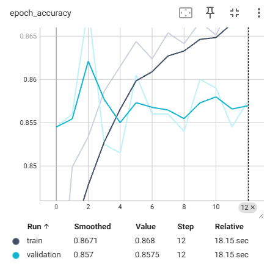
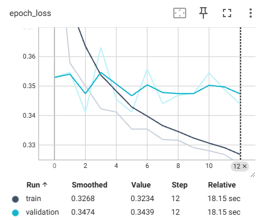

# 🏦 Customer Churn & Salary Prediction with Artificial Neural Networks

This project is part of a **learning-based Deep Learning project from a Udemy [Complete Data Science, Machine Learning, DL, NLP Bootcamp](https://www.udemy.com/certificate/UC-14b8d5ed-d5a1-4bb7-95c6-1788c0df30b9/)**, but with **significant modifications** to address a critical data leakage issue identified during implementation.  
The objective is to build **two separate Artificial Neural Network (ANN) models** to solve real-world business problems using the same dataset:  
1. **Churn Classification** – Predict whether a customer will leave the bank.  
2. **Salary Regression** – Estimate a customer’s salary based on their profile.

> ⚠️ This project **started as a guided tutorial** but was substantially refactored to fix **data leakage** discovered during implementation.

---

## 📌 Project Objectives

1. Perform **proper data preprocessing** without data leakage.
2. Build and train **ANN models for both classification and regression tasks**.
3. Conduct **hyperparameter tuning** to optimize model architecture.
4. Deploy both models as **interactive web applications using Streamlit**.
5. Understand the **end-to-end workflow of a deep learning project** – with emphasis on proper validation.

---

## 📌 Important Note for Recruiters / Portfolio Reviewers

> 🎯 **This project has a specific focus: Deep Learning implementation (ANN), model deployment, and identifying/fixing data leakage issues.**

This project is **intentionally scoped** to demonstrate:
- End-to-end ANN development for classification & regression
- Proper preprocessing pipelines without data leakage
- Hyperparameter tuning with cross-validation
- Model deployment using Streamlit

**What this project does NOT emphasize:**
- Exploratory Data Analysis (EDA)
- Feature engineering
- Data cleaning
- Statistical analysis

The dataset used is **already clean** and provided as-is from the bootcamp curriculum, so data cleaning/analysis steps are purposely omitted to focus solely on the deep learning workflow.

---

### 🔍 To See My Data Analysis & Feature Engineering Skills

If you are evaluating my **full data science capabilities** (including EDA, data cleaning, feature engineering, business insights, and risk modeling), please refer to my other project:

### 📊 [**Lending Club Credit Risk Modeling**](https://github.com/RevanzaIfannyA/lending-club-credit-risk-modeling)

That project demonstrates:
- Comprehensive EDA with visualizations
- Handling missing data and outliers
- Feature engineering and selection
- Business-driven insights
- Multiple modeling approaches with interpretation

---

### ✅ Summary for Recruiters

| Skill Area | This Project (Churn ANN) | Lending Club Project |
|------------|--------------------------|----------------------|
| Deep Learning / ANN | ✅ **Primary focus** | ❌ |
| Model Deployment (Streamlit) | ✅ | ❌ |
| EDA & Data Cleaning | ❌ (dataset already clean) | ✅ |
| Feature Engineering | ❌ | ✅ |
| Business Insights | ❌ | ✅ |
| Leakage Prevention | ✅ | ✅ |

**Both projects complement each other** – this one showcases my deep learning & deployment skills, while the Lending Club project showcases my data analysis & feature engineering capabilities.

---

## 🚨 Critical Fix: Eliminating Data Leakage

The original tutorial code contained a **critical data leakage bug**:

```python
# ❌ ORIGINAL (INCORRECT) APPROACH - DATA LEAKAGE
onehot_encoder = OneHotEncoder()
X_encoded = onehot_encoder.fit_transform(X)  # Leakage: fit on entire dataset
X_train, X_test = train_test_split(X_encoded, ...)  # Test data seen during encoding!
```

**Fix Applied:**

```python
# ✅ CORRECTED APPROACH - NO DATA LEAKAGE
X_train, X_test = train_test_split(X, ...)  # Split FIRST

# Fit encoders ONLY on training data
onehot_encoder = OneHotEncoder()
X_train_encoded = onehot_encoder.fit_transform(X_train[['Geography']])
X_test_encoded = onehot_encoder.transform(X_test[['Geography']])  # Transform only
```

This ensures that:
- Encoding transformations are learned **only from training data**
- Test data remains completely unseen during preprocessing
- Model evaluation reflects **real-world generalization performance**

---

## 📊 Dataset Overview

- **Dataset**: Bank Customer Churn Dataset  
- **Source**: Public dataset used in bootcamp  
- **Shape**: 10,000 rows × 14 columns  
- **Type**: Tabular data (numerical and categorical)

### Features
| Feature | Description |
|------|------------|
| CreditScore | Customer's credit score |
| Geography | Country (France, Germany, Spain) |
| Gender | Male or Female |
| Age | Customer's age |
| Tenure | Number of years with the bank |
| Balance | Account balance |
| NumOfProducts | Number of bank products used |
| HasCrCard | Whether the customer has a credit card |
| IsActiveMember | Whether the customer is active |
| EstimatedSalary | Customer's salary (target for regression) |
| Exited | Whether the customer left (target for classification) |

### Target Variables
- **Exited** (Binary: 1 = Churned, 0 = Stayed) – *for classification*
- **EstimatedSalary** (Continuous) – *for regression*

---

## 🔍 Data Preprocessing (Leakage-Free)

### Corrected Pipeline:
1. **Train-Test Split First** (80/20)
2. **Fit encoders on training data only**
3. **Transform both train and test data separately**
4. **Scale features using training statistics only**

### Preprocessing Objects Saved:
- OneHotEncoder for Gender (`OHE_gender.pkl`) – *fitted on train*
- OneHotEncoder for Geography (`OHE_geo.pkl`) – *fitted on train*
- StandardScaler (`scaler.pkl`) – *fitted on train*

---

## 🧠 Model 1: Churn Classification (ANN)

### Model Architecture:
- Input Layer: 13 features
- Hidden Layer 1: 64 neurons, ReLU activation
- Hidden Layer 2: 32 neurons, ReLU activation
- Output Layer: 1 neuron, Sigmoid activation

### Training:
- Optimizer: Adam (learning rate = 0.01)
- Loss: Binary Crossentropy
- Metrics: Accuracy
- Early Stopping: Patience = 10
- TensorBoard logging enabled

### Performance (After Leakage Fix):
- **Validation Accuracy**: ~86.5% (more reliable estimate)
- **Final Model Saved**: `model.h5`

epoch_accuracy:



epoch_loss:



---

## 📈 Model 2: Salary Regression (ANN)

### Model Architecture:
- Input Layer: 13 features
- Hidden Layer 1: 64 neurons, ReLU activation
- Hidden Layer 2: 32 neurons, ReLU activation
- Output Layer: 1 neuron (linear activation)

### Training:
- Optimizer: Adam
- Loss: Mean Absolute Error (MAE)
- Metrics: MAE
- Early Stopping: Patience = 10

### Performance (After Leakage Fix):
- **Test MAE**: ~50,409 (properly validated)
- **Final Model Saved**: `regression_model.h5`

---

## 🔬 Hyperparameter Tuning (Leakage-Free)

A separate experiment was conducted using **GridSearchCV with proper cross-validation** to determine the optimal ANN architecture.

### Tuned Parameters:
- Number of neurons: [16, 32, 64, 128]
- Number of hidden layers: [1, 2]
- Epochs: [50, 100]

### Best Configuration:
- **Neurons**: 16
- **Layers**: 1
- **Epochs**: 100
- **Best Score**: 85.68% (cross-validated)

---

## 🌐 Live Deployment

Both models are deployed as **interactive web applications** using **Streamlit**, with proper preprocessing pipeline integration.

### 1. Churn Prediction App
**Live URL**: [https://churnmodelingclassificationanndlproject-churn.streamlit.app/](https://churnmodelingclassificationanndlproject-churn.streamlit.app/)

**Key Features**:
- User-friendly input form for customer details
- Real-time churn probability calculation
- **Proper preprocessing using training-fitted encoders**
- Clear churn/stay recommendation


### 2. Salary Prediction App
**Live URL**: [https://churnmodelingclassificationanndlproject-salary.streamlit.app/](https://churnmodelingclassificationanndlproject-salary.streamlit.app/)

**Key Features**:
- Input form with sliders and dropdowns
- Instant salary estimation
- **Leakage-free preprocessing pipeline**
- Clean, professional UI


---

## 🛠️ Tech Stack

- **Language**: Python 3.8+
- **Deep Learning**: TensorFlow/Keras
- **Data Processing**: Pandas
- **Preprocessing**: Scikit-learn (with proper train/test separation)
- **Hyperparameter Tuning**: GridSearchCV with cross-validation
- **Deployment**: Streamlit
- **Version Control**: Git & GitHub

---

## 🎯 Key Learning Points

### What I Learned Beyond the Tutorial:
1. **Identifying Data Leakage**: Recognizing when preprocessing contaminates test data
2. **Proper Pipeline Design**: Ensuring transformations are learned only from training data
3. **Model Validation**: Understanding why leakage leads to overly optimistic performance
4. **Debugging ML Pipelines**: Systematic approach to identifying and fixing pipeline issues

### Technical Skills Gained:
- Building and training **ANN models for both classification and regression**
- **Data preprocessing without leakage** (correct train/test split order)
- **Hyperparameter tuning** with proper cross-validation
- **Model persistence** with complete preprocessing pipeline
- **Streamlit deployment** for interactive ML applications

---

## 👤 Author

**Revan**  
[revanzalfanny@gmail.com](mailto:revanzalfanny@gmail.com)  
*Data Science Bootcamp Participant - with critical thinking applied*

---

## 📜 License

This project is for **educational purposes** as part of a guided bootcamp curriculum.  
The **data leakage fixes** represent original critical thinking applied to tutorial material.